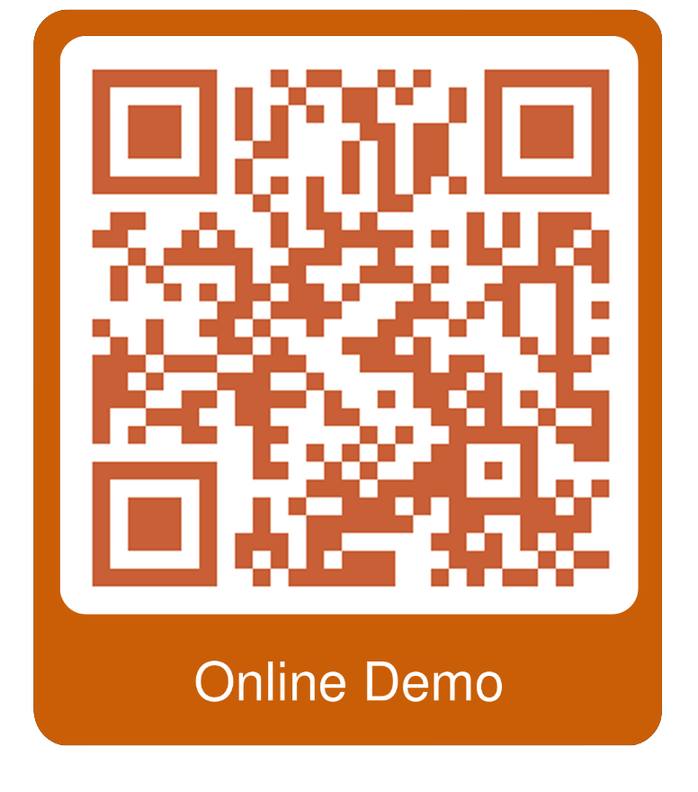

<p align="center">

</p>
<p align="center">
<a href="https://github.com/UBC-NLP/afrolid/releases">
        
    </a>

<a href="https://demos.dlnlp.ai/afrolid">
        
    </a>
<a href="https://github.com/UBC-NLP/afrolid/blob/main/LICENSE"></a>
<a href='https://afrolid.readthedocs.io/en/latest/?badge=latest'></a>
<a href="https://github.com/UBC-NLP/afrolid/stargazers"></a>
<a href="https://github.com/UBC-NLP/afrolid/network"></a>
</p>

 



AfroLID, a neural LID toolkit for 517 African languages and varieties. AfroLID exploits a multi-domain web dataset manually curated from across 14 language families utilizing five orthographic systems. AfroLID is described in this paper: 
[**AfroLID: A Neural Language Identification Tool for African Languages**](https://arxiv.org/abs/2210.11744).

<br>

## Requirements
- Download AfroLID model:
```shell
    wget https://demos.dlnlp.ai/afrolid/afrolid_model.tar.gz
    tar -xf afrolid_model.tar.gz
```

## Installation
- To install AfroLID and develop directly using pip:
```shell
    pip install -U afrolid
```
- To install AfroLID and develop directly GitHub repo using pip:
```shell
    pip install -U git+https://github.com/UBC-NLP/afrolid.git
```
- To install AfroLID and develop locally:
```shell
    git clone https://github.com/UBC-NLP/afrolid.git
    cd afrolid
    pip install .
```
## Getting Started
The [full documentation](https://afrolid.readthedocs.io/en/latest/) contains instructions for getting started, translation using diffrent methods, intergrate AfroLID with your code, and provides more examples.

## Colab Examples
### (1) Integrate AfroLID with your python code
<table style='border:1px red;' width='100%'>
<tr><td> <b>Content</b></td><td><b>Colab link</b></td></tr>
<td>
    <ul>
        <li> Install AfroLID </li>
        <li> Download AfroLID's model </li>
        <li> Initial AfroLID object </li>
        <li> Get language prediction(s)</li> 
        <li> Integrate with Pandas</li>
    </ul>
</td>
<td> <a href="https://colab.research.google.com/github/UBC-NLP/afrolid/blob/main/examples/Integrate_afrolid_with_your_code.ipynb"></td>
</tr>
</table>

### (2) Command Line Interface
<table style='border:1px red;' width='100%'>
<tr><td><b>Command</b></td><td> <b>Content</b></td><td><b>Colab link</b></td></tr>
<tr>
<td>afrolid_cli</td>
<td>
    <ul>
        <li> Usage and Arguments </li>
        <li> Examples</li>
    </ul>
</td>
<td> <a href="https://colab.research.google.com/github/UBC-NLP/afrolid/blob/main/examples/afrolid_interactive_cli.ipynb"></td>
</tr>
<tr>

</table>

## Supported languages
Please refer to [**suported-languages**](https://github.com/UBC-NLP/afrolid/blob/main/supported-languages)

## License
afrolid(-py) is Apache-2.0 licensed. The license applies to the pre-trained models as well.

## Citation
If you use AfroLID toolkit or the pre-trained models for your scientific publication, or if you find the resources in this repository useful, please cite our paper as follows (to be updated):
```
@article{adebara2022afrolid,
  title={AfroLID: A Neural Language Identification Tool for African Languages},
  author={Adebara, Ife and Elmadany, AbdelRahim and Abdul-Mageed, Muhammad and Inciarte, Alcides Alcoba},
  booktitle = "Proceedings of the 2022 Conference on Empirical Methods in Natural Language Processing (EMNLP)",
  month = December,
  year = "2022",
}

```


## Acknowledgments
We gratefully acknowledge support from Canada Research Chairs (CRC), the Natural Sciences and Engineering Research Council of Canada (NSERC; RGPIN-2018-04267), the Social Sciences and Humanities Research Council of Canada (SSHRC; 435-2018-0576; 895-2020-1004; 895-2021-1008), Canadian Foundation for Innovation (CFI; 37771), [Digital Research Alliance of Canada](www.alliancecan.ca/en), [UBC ARC-Sockeye](https://arc.ubc.ca/ubc-arc-sockeye), Advanced Micro Devices, Inc. (AMD), and Google. Any opinions, conclusions or recommendations expressed in this material are those of the author(s) and do not necessarily reflect the views of CRC, NSERC, SSHRC, CFI, CC, AMD, Google, or UBC ARC-Sockeye. 
