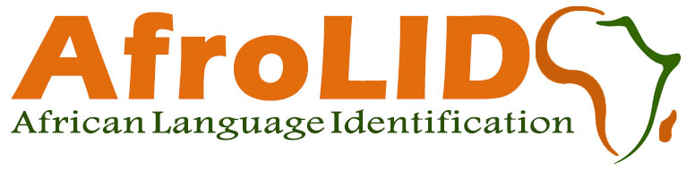

     
    
     

Language identification (LID) is a crucial precursor for natural language processing, especially when crawling data from the web. Unfortunately, the majority of low resource languages are either not covered at all or poorly covered by current LID technologies. We address this important problem for 517 African language varieties by introducing AfroLID. To develop AfroLID, we manually curate a multi-domain dataset from the web for these languages across 13 language families and 5 orthographic scripts. AfroLID ~achieves 95.89 F1-score on our blind test data. We compare the utility of our model with five LID tools covering various numbers of African languages, showing that AfroLID significantly outperforms all of these in every experiment we perform. To show the utility of AfroLID in real-world scenarios, we test its performance in the wild (including to identify 88 African languages in the acutely-needed Twitter setting). We also perform a number of case studies and error analyses, allowing us to offer linguistically-motivated insights as to AfroLID's capabilities.
